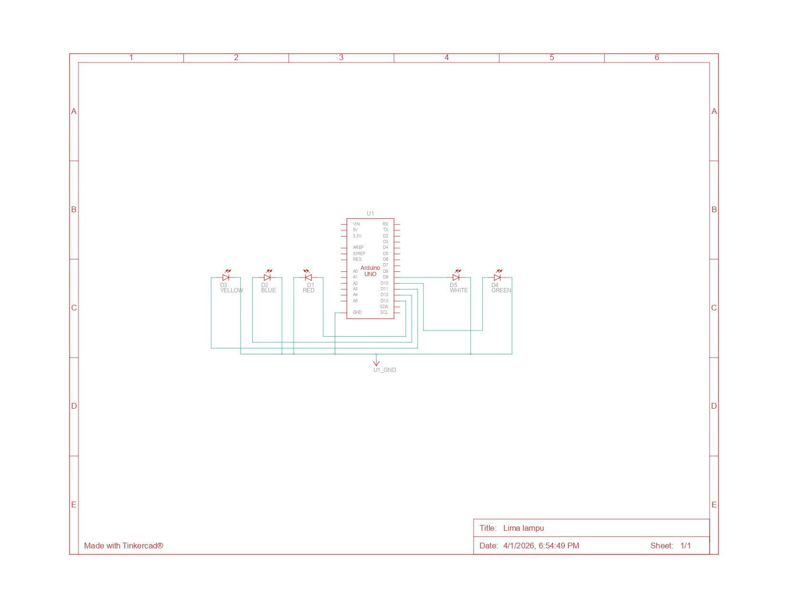

1.6.4 Pertanyaan Praktikum
1. Gambarkan rangkaian schematic 5 LED running yang digunakan pada percobaan!
   
   **Jawaban:**
   

2. Jelaskan bagaimana program membuat efek LED berjalan dari kiri ke kanan!

   **Jawaban:**
   Efek LED berjalan dari kiri ke kanan dibuat oleh perulangan `for` yang pertama di dalam fungsi `loop()`:
   ```c++
   // looping dari pin rendah ke tinggi
   for (int ledPin = 2; ledPin < 8; ledPin++) {
     // hidupkan LED pin nya:
     digitalWrite(ledPin, HIGH);
     delay(timer);
     // matikan pin LED nya:
     digitalWrite(ledPin, LOW);
   }
   ```
   - Perulangan ini dimulai dari `ledPin = 2` dan berlanjut hingga `ledPin = 7`.
   - Di setiap iterasi, program akan menyalakan satu LED (`digitalWrite(ledPin, HIGH)`), menunggu sejenak selama 100 milidetik (`delay(timer)`), lalu mematikannya kembali (`digitalWrite(ledPin, LOW)`).
   - Karena proses ini terjadi secara berurutan dari pin 2, 3, 4, 5, 6, hingga 7, mata kita menangkapnya sebagai satu titik cahaya yang bergerak dari satu sisi ke sisi lain (kiri ke kanan).

3. Jelaskan bagaimana program membuat LED kembali dari kanan ke kiri!

   **Jawaban:**
   Efek LED berjalan kembali (kanan ke kiri) dibuat oleh perulangan `for` yang kedua:
   ```c++
   // looping dari pin yang tinggi ke yang rendah
   for (int ledPin = 7; ledPin >= 2; ledPin--) {
     // menghidupkan pin:
     digitalWrite(ledPin, HIGH);
     delay(timer);
     // mematikan pin:
     digitalWrite(ledPin, LOW);
   }
   ```
   - Perulangan ini bekerja secara terbalik. Dimulai dari `ledPin = 7` dan hitung mundur hingga `ledPin = 2`.
   - Sama seperti sebelumnya, di setiap iterasi, LED pada pin yang sedang ditunjuk akan menyala, berhenti sejenak, lalu mati.
   - Karena urutannya dari pin 7, 6, 5, 4, 3, hingga 2, efek visual yang dihasilkan adalah titik cahaya yang bergerak kembali dari kanan ke kiri.

4. Buatkan program agar LED menyala tiga LED kanan dan tiga LED kiri secara bergantian
dan berikan penjelasan disetiap baris kode nya dalam bentuk README.md!
   
   **Jawaban:**
   Program dan penjelasannya akan dibuat pada file terpisah (`tugas_akhir.ino` dan `README.md`).