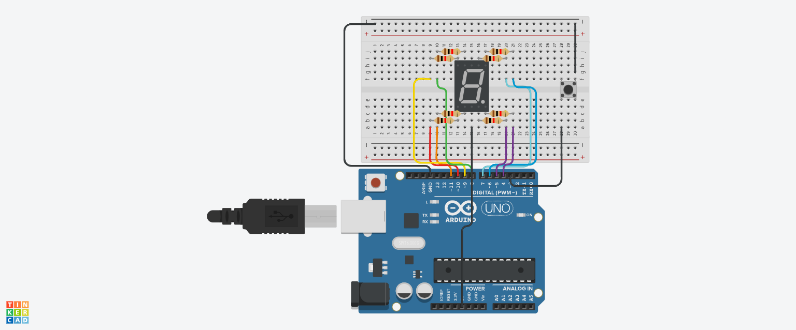

---

## **2.6.4 Pertanyaan Praktikum (Kontrol Counter dengan Push Button)**

### 1. Gambarkan rangkaian schematic yang digunakan pada percobaan!

**Jawaban:**  


---

### 2. Mengapa pada push button digunakan mode `INPUT_PULLUP` pada Arduino Uno? Apa keuntungannya dibandingkan rangkaian biasa?

**Jawaban:**  
- **INPUT_PULLUP** mengaktifkan resistor pull-up internal (≈20kΩ) di dalam mikrokontroler.
- **Keuntungan:**
  - Tidak perlu resistor eksternal.
  - Rangkaian lebih sederhana.
  - Menghemat tempat di breadboard.
  - Pin terbaca HIGH saat tidak ditekan, LOW saat ditekan (logika terbalik).

---

### 3. Jika salah satu LED segmen tidak menyala, apa saja kemungkinan penyebabnya dari sisi hardware maupun software?

**Jawaban:**  

| Hardware | Software |
|----------|----------|
| Kabel jumper putus atau longgar | Pin yang salah dalam array segmentPins |
| Resistor 220 Ohm rusak atau terlalu besar | Pola segmen (hexPatterns) salah untuk segmen tersebut |
| LED segmen internal rusak | Fungsi `displayNumber()` tidak menjangkau semua pin |
| Seven segment jenis berbeda (common anode vs cathode) | Lupa set pinMode sebagai OUTPUT |
| Ground atau VCC tidak terhubung dengan benar | Kesalahan loop atau tidak dipanggil |

---

### 4. Modifikasi rangkaian dan program dengan dua push button (increment & decrement) dan berikan penjelasan setiap baris kode dalam `README.md`

**Jawaban (README.md):**

```markdown
# Counter dengan Dua Push Button (Increment & Decrement)

## Rangkaian
- Button Increment → Pin 3
- Button Decrement → Pin 2
- Seven segment → Pin 7,6,5,11,10,8,9,4 (a-g, dp)

## Penjelasan Kode

```cpp
int segmentPins[] = {7,6,5,11,10,8,9,4};
byte hexPatterns[] = {0x3F,0x06,0x5B,0x4F,0x66,0x6D,0x7D,0x07,
                      0x7F,0x6F,0x77,0x7C,0x39,0x5E,0x79,0x71};

int counter = 0;
int pinInc = 3;
int pinDec = 2;
int lastIncState = HIGH;
int lastDecState = HIGH;

void setup() {
  for (int i = 0; i < 8; i++) {
    pinMode(segmentPins[i], OUTPUT);
  }
  pinMode(pinInc, INPUT_PULLUP);
  pinMode(pinDec, INPUT_PULLUP);
  displayNumber(counter);
}

void loop() {
  int incState = digitalRead(pinInc);
  int decState = digitalRead(pinDec);

  // Increment saat button ditekan (LOW)
  if (incState == LOW && lastIncState == HIGH) {
    counter++;
    if (counter > 15) counter = 0;
    displayNumber(counter);
    delay(50); // debouncing sederhana
  }
  lastIncState = incState;

  // Decrement saat button ditekan
  if (decState == LOW && lastDecState == HIGH) {
    counter--;
    if (counter < 0) counter = 15;
    displayNumber(counter);
    delay(50);
  }
  lastDecState = decState;
}

void displayNumber(int num) {
  byte pattern = hexPatterns[num];
  for (int i = 0; i < 8; i++) {
    digitalWrite(segmentPins[i], (pattern >> i) & 1);
  }
}