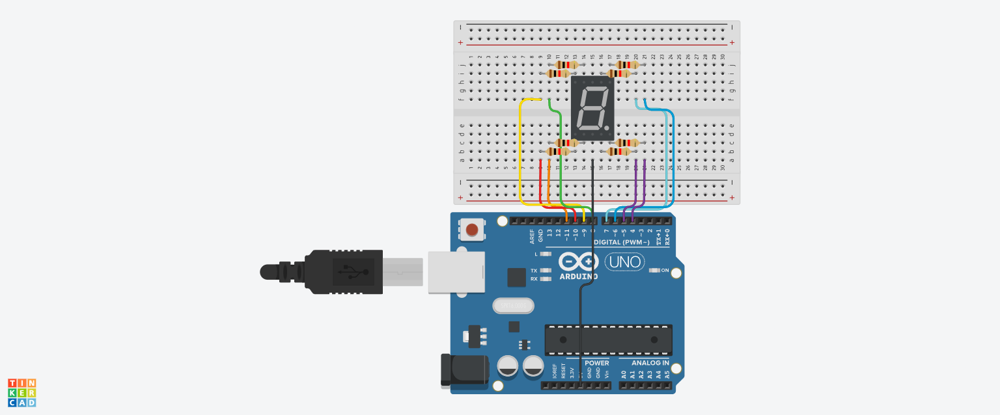

# Pertanyaan Praktikum 7-Segment

## Pertanyaan

1. **Gambarkan rangkaian schematic yang digunakan pada percobaan!**
2. **Apa yang terjadi jika nilai num lebih dari 15?**
3. **Apakah program ini menggunakan common cathode atau common anode? Jelaskan alasannya!**
4. **Modifikasi program agar tampilan berjalan dari F ke 0 dan berikan penjelasan di setiap baris kode nya dalam bentuk README.md!**

## Jawaban

1. 

2. Jika `num > 15`, maka array `hexSegments[]` yang hanya berisi 16 elemen (0–15) akan diakses di luar batas (**out of bounds**). Hal ini dapat menyebabkan:
   - Tampilan seven segment menjadi tidak terduga (acak).
   - Program bisa **crash** atau **reset**.
   - Data lain di memori bisa rusak.

   **Solusi**: Batasi nilai `num` dengan `num % 16` atau gunakan kondisi `if (num > 15) num = 0;`.

3. Berdasarkan konfigurasi dan logika yang umum digunakan pada modul praktikum, program ini menggunakan **Seven Segment Common Cathode**.

   **Alasan**:
   - Pada **common cathode**, segmen menyala saat pin diberikan **HIGH (1)**.
   - Pada **common anode**, segmen menyala saat pin diberikan **LOW (0)**.
   - Biasanya, array pola segmen pada modul ditulis dalam bentuk logika HIGH untuk menyalakan LED (misal `0x3F` untuk angka 0). Jika menggunakan common anode, pola harus dikomplemen.

4. ### Modifikasi Program: Seven Segment Counter F → 0

Berikut kode lengkap dengan penjelasan di setiap bagian penting:

```cpp
// Pin yang terhubung ke segmen seven segment
// Indeks: a=0, b=1, c=2, d=3, e=4, f=5, g=6, dp=7
int segmentPins[] = {7, 6, 5, 11, 10, 8, 9, 4};

// Pola hex untuk angka 0-15 (common cathode)
// Setiap byte merepresentasikan status 8 segmen (bit 0=a, bit 7=dp)
// Contoh: 0x3F (00111111) = angka 0 (segmen a,b,c,d,e,f nyala)
byte hexPatterns[] = {
  0x3F, 0x06, 0x5B, 0x4F, 0x66, 0x6D, 0x7D, 0x07,  // 0-7
  0x7F, 0x6F, 0x77, 0x7C, 0x39, 0x5E, 0x79, 0x71   // 8-F
};

void setup() {
  // Konfigurasi semua pin segmen sebagai OUTPUT
  for (int i = 0; i < 8; i++) {
    pinMode(segmentPins[i], OUTPUT);
  }
}

void loop() {
  // Loop utama: Tampilkan angka dari F (15) ke 0
  for (int num = 15; num >= 0; num--) {
    displayNumber(num);
    delay(1000);  // Delay 1 detik per angka
  }
}

// Fungsi untuk menampilkan angka/hex pada 7-segment
// Mengambil pola dari array dan set setiap segmen sesuai bit
void displayNumber(int num) {
  byte pattern = hexPatterns[num];  // Ambil pola byte untuk angka tersebut
  for (int i = 0; i < 8; i++) {
    // Ekstrak bit ke-i: shift right i kali & AND 1
    int bitStatus = (pattern >> i) & 1;
    digitalWrite(segmentPins[i], bitStatus);
  }
}
```

**Penjelasan Tambahan**:
- **Array `hexPatterns[]`**: Menyimpan pola bit untuk 16 karakter (0-F).
- **Loop `for (num = 15; num >= 0; num--)`**: Menghitung mundur dari F ke 0.
- **Bit manipulation `(pattern >> i) & 1`**: Efisien untuk membaca status setiap segmen.

